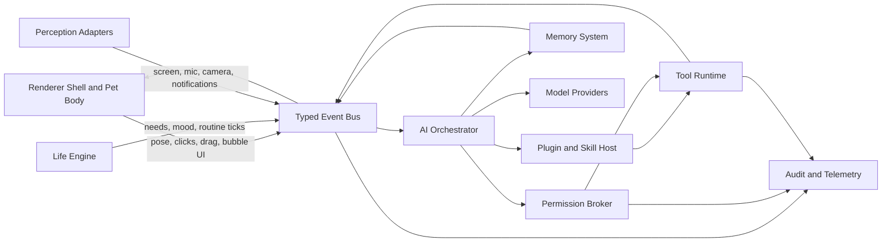
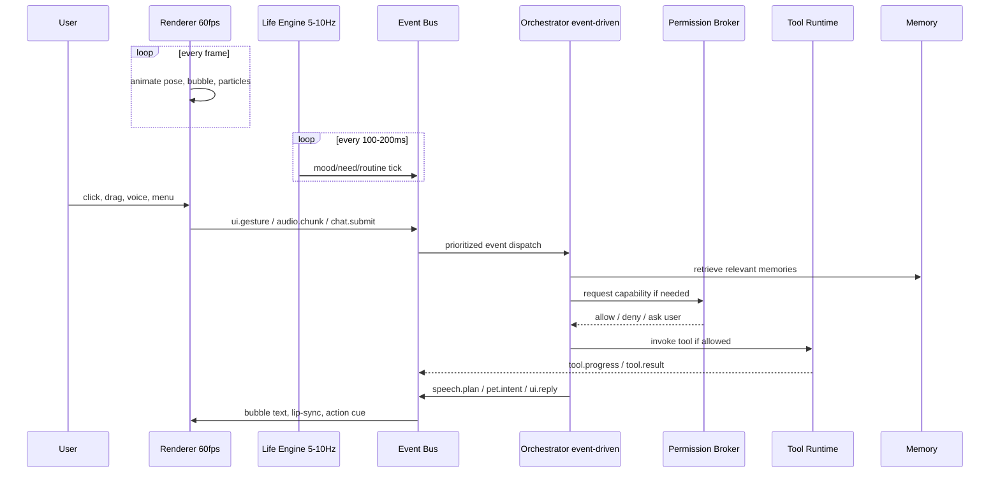
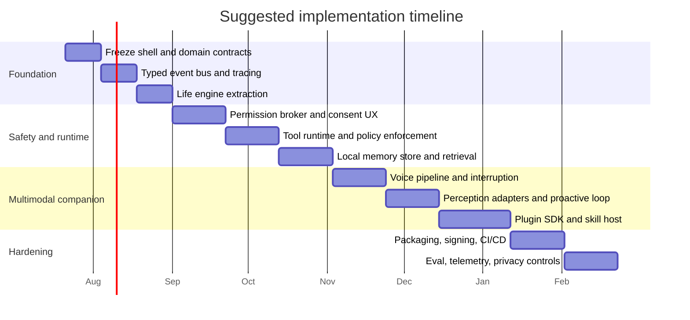

# End-to-end development plan for `desktop_pet`

> Status: v1.2 growth-system implementation and acceptance complete, revised 2026-07-20
> Current implementation package: `vla_pet`  
> Immediate release target: `v1.2.1` character-art and directional-rendering patch
> Delivery path: the staged `v0.3`–`v1.0` slices in sections 0.13 and 7

The measured v1.0 acceptance records are in
[`docs/release-evidence-v0.2.md`](docs/release-evidence-v0.2.md) and
[`docs/release-evidence-v1.0.md`](docs/release-evidence-v1.0.md). Public binary
distribution of v1.2 uses the provenance-documented Momo v3 growth pack; unresolved
prototype sprites remain excluded from its artifact.

**Refined execution goal:** ship `v1.2.1` as an installed, local-first living
desktop companion with a cozy tactile habitat on the Linux/GNOME Wayland
reference host. One lazy worker
coordinates SmolLM, SmolVLM, and Whisper while the renderer, deterministic life
loop, memory, permissions, tools, awareness, progression, plugins, recovery,
updates, and deployment remain independently testable and privacy bounded. The
release is accepted only through the v1.0 baseline and section 0.15.

## 0. Delivery contract

The v0.2 material below is the accepted compatibility baseline. The current
release contract is section 0.13, which integrates the v0.3–v1.0 slices into one
installed application. Sections 1–9 retain the longer architectural rationale;
they do not override the explicit v1.0 boundaries or acceptance gates.

### 0.1 Definition of end to end

For v0.2, “end to end” means a new Linux user can install one built artifact,
launch the pet without AI weights, understand and grant optional permissions,
interact with a continuously animated deterministic pet, opt into the local
SmolVLM + SmolLM stack, recover from an AI failure, inspect diagnostics, retain
non-sensitive state across restarts, and uninstall the application cleanly.

The release is complete only when all of these layers work together:

```text
package/install
  → configuration + data directories
  → single-instance application lifecycle
  → overlay/input/rendering
  → deterministic life engine
  → event/orchestration boundary
  → optional SmolLM/SmolVLM providers
  → permission-gated desktop context
  → persistence + redacted diagnostics
  → graceful shutdown/restart/uninstall
```

### 0.2 v0.2 requirements and acceptance evidence

| ID | Requirement | Acceptance evidence |
|---|---|---|
| E2E-001 | The pet is useful in `--mock-policy` mode with no model dependency or network access. | Headless launch test and 30-minute deterministic soak mode. |
| E2E-002 | Rendering remains independent of model latency; deterministic behavior runs locally while cognition is queued. | Unit tests for life ticks plus UI heartbeat during a blocked mock worker. |
| E2E-003 | UI, life, AI, persistence, and platform inputs communicate through typed events/commands and one authoritative runtime state. | Contract tests; overlay does not import concrete model classes. |
| E2E-004 | SmolLM and SmolVLM are provider implementations behind interfaces and share one lazy, restartable AI worker. | Provider contract tests and `scripts/smoke_coop.py`; one worker PID. |
| E2E-005 | Character assets are loaded from a versioned manifest with validation and safe fallback behavior. | Manifest contract tests; current character loads without Python asset mapping edits. |
| E2E-006 | Mood, energy, social need, boredom, and high-level behavior evolve deterministically and persist across restart. | Fake-clock unit tests and SQLite restart test. |
| E2E-007 | Conversation metadata, user preferences, pet state, and meaningful events persist in SQLite without placing raw chat or screenshots in production logs. | Migration, redaction, retention, export, and delete tests. |
| E2E-008 | Screenshot and notification access are disabled by default and enforced by a capability policy before platform access. | Permission unit/integration tests; denied access never calls the sensor. |
| E2E-009 | Failures have stable categories, visible fallback behavior, redacted logs, and a diagnostics command. | Fault-injection tests and `momo-chan --diagnostics`. |
| E2E-010 | A Linux wheel plus desktop integration installer can install, launch, autostart optionally, and uninstall without deleting user data unless requested. | Build/install smoke test in a temporary prefix. |
| E2E-011 | CI runs lint, compilation checks, unit/integration tests, coverage, package build, and headless launch without downloading models. | GitHub Actions workflow passes from a clean checkout. |
| E2E-012 | The real cached CPU models can chat, answer a user-authorized screen question, and turn a confirmed language request into a safe visual action. | Offline model smoke and live overlay checklist. |
| E2E-013 | Permission decisions distinguish explicit one-shot consent from session grants, support revocation, and deny all reserved high-risk capabilities in safe mode. | Broker contract tests prove a denied operation is never invoked. |
| E2E-014 | Versioned event envelopes carry identity, priority, session, trace, and idempotency metadata without making UI dispatch asynchronous. | Event validation and duplicate-suppression tests. |

### 0.3 Explicit v0.2 non-goals

These remain planned, but are not allowed to destabilize the first deployable
slice:

* Voice/STT/TTS and wake-word support.
* Unrestricted tools, shell access, browser automation, or MCP plugins.
* Cloud providers and account systems.
* Embedding/vector memory or knowledge graphs.
* Live2D, VRM, mobile, Windows, and macOS packaging.
* Automatic updating, stores, inventory, mini-games, and downloadable code plugins.

Interfaces may reserve these capabilities, but v0.2 must not ship placeholder UI
that claims they work.

### 0.4 Architectural invariants

1. The renderer and physics never wait for model inference.
2. Real-model mode owns exactly one AI worker; mock and safe modes use the same
   contracts in-process and spawn no model worker.
3. SmolLM owns language intent and wording; SmolVLM owns visual evidence and
   visually grounded semantic action selection; deterministic code owns motion
   and safety.
4. Normal walking, breathing, idle reactions, and need decay never require an
   AI request.
5. Screen pixels are captured once per authorized request, processed locally,
   never persisted, and never included in diagnostics.
6. Raw chat is stored only in the private SQLite store when conversation
   persistence is enabled; it is never written to JSONL operational logs.
7. Every optional sensor or tool is checked by code against a named capability.
8. Model/provider failure degrades to deterministic behavior without terminating
   the UI.
9. Persistent schemas and character manifests are versioned and migrated or
   rejected with an actionable error.
10. Packaging never bundles model weights by default.

### 0.5 v0.2 component boundaries

```text
Qt adapters ──publish──▶ EventBus ──▶ RuntimeController ──▶ PetState
    ▲                                      │                   │
    │                                      ├─ LifeEngine       │
    └──────────── render snapshot ◀────────┤                   │
                                           ├─ AIOrchestrator ──▶ one worker
                                           ├─ PermissionPolicy ─▶ sensors
                                           └─ StateRepository ─▶ SQLite
```

The event bus is synchronous and in-process for deterministic UI/life events.
Heavy inference remains in the existing spawned process. Events are immutable;
state mutation occurs only in the runtime controller and world/life engines.

### 0.6 Data and privacy model

Use platform-appropriate user directories, never the current working directory:

```text
config: $XDG_CONFIG_HOME/vla-pet/config.json
data:   $XDG_DATA_HOME/vla-pet/pet.db
cache:  $XDG_CACHE_HOME/vla-pet/ and the configured Hugging Face cache
logs:   $XDG_STATE_HOME/vla-pet/logs/
```

The versioned SQLite schema owns settings, pet state, relationship state,
conversation turns, and meaningful events. Migrations execute transactionally.
The user can export private data, clear conversations, reset pet state, or delete
all application data. Operational logs contain lengths, categories, timings, and
stable error codes—not message bodies, notification text, window titles, or
screen pixels.

Capabilities for v0.2:

* `SCREEN_CAPTURE_EACH_TIME` — explicit user action and portal approval.
* `NOTIFICATION_MONITOR_SESSION` — opt-in for the current run; never silently enabled.
* `PERSIST_CONVERSATION` — opt-in setting with clear/delete controls.
* `AUTOSTART` — installer setting, disabled by default.

### 0.7 Performance and reliability budgets

* Overlay appears within 1 second in mock mode on the reference Linux machine.
* The CPU-first renderer targets a 30 FPS physics/UI cadence, coalesces sub-pixel
  movement, and performs no filesystem, database, or inference work in paint
  callbacks. Fast drag/fall motion still repaints every tick.
* Life engine tick work stays below 2 ms at p95 in unit benchmarks.
* Idle mock mode targets below 3% of one CPU core over a five-minute sample on
  the reference GNOME/Qt environment.
* Only one 256×256 synthetic image is created for a visual action request.
* Normal autonomous cognition occurs no more than once every 15 seconds; urgent
  user requests may bypass this interval.
* AI requests are bounded, deduplicated by semantic kind, and recover after the
  configured timeout without restarting the overlay.
* Shutdown gives the worker 2 seconds, then terminates it and releases the
  per-monitor lock.

Performance numbers are recorded as evidence, not silently treated as passing
when the measurement command was skipped.

### 0.8 Deployment and rollback

Primary matrix: Ubuntu 22.04/24.04, Python 3.10–3.12, X11 and GNOME Wayland.
The release artifact is a Python wheel with a Linux desktop installer that writes
only into an explicit prefix and XDG user directories. A source checkout remains
a supported developer installation. Model dependencies are an optional extra.

Rollout order:

1. Clean venv, mock mode, no network.
2. Temporary-prefix install and uninstall.
3. X11/Wayland live overlay check.
4. Cached CPU-model smoke.
5. Release candidate tag only after the evidence report is complete.

Rollback means reinstalling the previous wheel; schema migrations must retain a
backup before destructive changes. Safe mode (`--safe-mode`) disables AI,
notifications, persistence writes, and non-default character packs.

### 0.9 Verification commands

The repository must provide one deterministic umbrella command, with individual
commands remaining useful for diagnosis:

```bash
python scripts/verify_project.py
python -m pytest
python -m ruff check src tests scripts
python -m compileall -q src scripts
python -m build --no-isolation
python scripts/verify_release.py --artifact dist/*.whl
momo-chan --mock-policy --headless --max-seconds 3 --no-log
HF_HUB_OFFLINE=1 TRANSFORMERS_OFFLINE=1 python scripts/smoke_coop.py
```

Live-only checks must be clearly marked rather than faked in headless CI:
click-through, always-on-top behavior, dragging/falling, screenshot portal,
notification monitoring, and visible frame smoothness.

### 0.10 Implementation order and status

- [x] Audit the prototype and define the v0.2 delivery contract.
- [x] Establish quality tooling, CI, stable errors, XDG paths, and diagnostics.
- [x] Add typed events, runtime state, and deterministic life engine.
- [x] Add provider interfaces and route the existing worker through them.
- [x] Add character-pack manifest and animation controller.
- [x] Add SQLite schema/migrations, persistence policy, export, and deletion.
- [x] Add capability enforcement around screenshots and notifications.
- [x] Split the overlay behind runtime/platform adapters without regressing input.
- [x] Add wheel/desktop installer, safe mode, and release verification script.
- [x] Pass all automated, package, cached-model, simulated-soak, and GNOME
  Wayland live acceptance gates; record the remaining pretrained-model and
  asset-provenance limitations in the release evidence.

### 0.11 Risk register

| Risk | Mitigation | Release blocker |
|---|---|---|
| CPU contention between two models | One sequential worker, lazy providers, semantic rate limit. | Yes |
| Small-model malformed/repetitive output | Constrained labels, deterministic sanitization, fallbacks, regression prompts. | Yes |
| Wayland click-through or capture differs by compositor | Platform capability probe, portal fallback, documented live matrix. | Yes for GNOME; documented limitation elsewhere |
| Corrupt database or config | Transactions, migration backup, safe mode, actionable diagnostics. | Yes |
| Character pack has missing/unsafe paths | Schema validation, root containment, built-in fallback character. | Yes |
| Private data leaks into logs | Central redactor and tests using sentinel secrets. | Yes |
| Scope expands into the entire v1 roadmap | Enforce section 0.3 and finish v0.2 evidence first. | Yes |

### 0.12 Reconciliation with the appended companion-harness plan

The appended research plan is the architectural north star, not a second
simultaneous release contract. Its six subsystems map to releases as follows:

| Harness subsystem | v0.2 decision | Later delivery |
|---|---|---|
| Renderer shell | Preserve and modularize the current Qt overlay, animation, input, drag/drop, and click-through behavior. | Rich avatars, accessories, voice/lip-sync, and cross-platform shells. |
| Life engine | Ship deterministic needs, emotion, routine intent, relationship state, and persistence with no model dependency. | Deeper routines, progression, objects, and reflection. |
| AI orchestrator | Ship one restartable queue/worker with provider interfaces and bounded SmolLM → SmolVLM action flow. | Streaming, routing, planning, interruption, and remote providers. |
| Permission broker | Ship named one-shot/session grants, revocation, safe-mode denial, and code-enforced capture/notification gates. | User-facing permission center and scoped file/network/browser/automation grants. |
| Tool runtime | Reserve typed capabilities only; execute no shell, browser, filesystem, network, or third-party code in v0.2. | Allowlisted subprocess tools and MCP begin in v0.3 after adversarial tests. |
| Memory/plugin ecosystem | Ship private state, opt-in chat, meaningful events, export/reset/delete, and versioned character manifests. | Four-tier retrieval, skill manifests, quotas, and plugin hosting after governance exists. |

This sequencing follows the appended plan's most important constraint: the pet
may become more capable, but never less inspectable. A later milestone cannot
bypass the permission broker by importing a tool directly into the renderer or
model worker.

### 0.13 v1.0 execution contract

The accepted v0.2 release is the compatibility baseline. v1.0 is complete only
when the following release slices work together in one installed application;
an interface or placeholder alone does not satisfy a user-facing requirement.

| Slice | Required end-to-end capability | Gate |
|---|---|---|
| v0.3 Talks | Cancellable incremental chat, configurable local persona, provider metadata, and an always-on-top settings surface. | Mock stream contract plus real cached SmolLM regression; cancellation never blocks Qt. |
| v0.4 Remembers | Working, episodic, semantic/profile, task, relationship, and procedural memory with FTS retrieval, deduplication, expiry, inspection, export, and deletion. | Restart remembers one preference, task, and shared event without replaying raw history. |
| v0.5 Speaks | Push-to-talk audio session, pluggable STT/TTS, visible listening/thinking/speaking states, playback cancellation, and self-echo suppression. | Deterministic PCM/provider test and live device/provider probe; unavailable optional engines degrade visibly to text. |
| v0.6 Helps | Brokered timer, Pomodoro, todo, reminder, note, clipboard, approved-file read/search, screenshot, notification, and application-open tools with schemas, timeout, confirmation, result validation, and redacted audit. | Adversarial tests prove direct/model/plugin calls cannot bypass capability checks or path/domain scope. |
| v0.7 Aware | Opt-in active-window, user-idle, battery/network, notification, focus, and coding-session signals; deny lists, privacy mode, retention, rate-limited proactivity, and a visible reason for every reaction. | Sensors are off by default and proactive events are deterministic, explainable, suppressible, and never capture a screen implicitly. |
| v0.8 Plays | Affection/XP progression, milestones, inventory, food/toy interactions, achievements, daily activities, a bounded mini-game, and room mode with no punishing decay. | State persists and the complete progression loop works with AI disabled. |
| v0.9 Extensible | Versioned character/persona/voice manifests, tool-plugin manifests, integrity/signature verification, namespaced storage/quotas, permission declarations, plugin management, and a permission-gated MCP stdio bridge. | Two bundled plugins and one sample character validate; unsigned/unscoped third-party execution is refused. |
| v1.0 Ships | Guided onboarding, tray/settings/privacy/memory/audit controls, backup/restore, migrations, signed update-manifest verification, safe recovery, release channels, cross-platform contract CI, Linux deployment, and stable specs. | Clean install → onboard → use → restart → upgrade → rollback → restore → uninstall passes; live GNOME Wayland acceptance passes. |

#### v1.0 hard boundaries

* Linux/GNOME Wayland is the live reference platform available for this release.
  Windows and macOS must pass pure-domain/platform-contract CI and have validated
  packaging metadata, but live OS acceptance cannot be claimed without runners
  or hardware for those operating systems.
* The repository ships signing, checksum, update-manifest, and verification
  machinery. Public store certificates, notarization credentials, an update
  server, and publishing accounts are operator-supplied external release inputs.
* Local SmolLM and SmolVLM remain the default cognition stack. Voice engines,
  alternate providers, MCP servers, and third-party plugins are optional and
  lazy; missing optional components must not prevent text/pet operation.
* No arbitrary shell, unrestricted desktop automation, silent microphone,
  continuous screenshot recording, unsigned third-party code, cloud telemetry,
  or remote training data upload is enabled in the stable profile.
* Public redistribution of the bundled prototype artwork remains blocked until
  its provenance is completed, even when the application and locally built
  artifact pass technical acceptance.

#### v1.0 global budgets

* The renderer remains independent from cognition, voice, sensors, tools,
  memory, updates, and plugins; no blocking operation executes in a paint/input
  callback.
* Safe/mock idle stays below 3% of one reference CPU core over five minutes and
  the visible shell appears within one second.
* Memory retrieval p95 stays below 50 ms for 10,000 local synthetic items; a
  denied tool starts zero handler/subprocess work; interruption updates visible
  audio state within 100 ms in deterministic tests.
* Every sensitive operation carries subject, capability, scope, lifetime,
  reason, trace, result category, and audit identity. Audit payloads exclude raw
  chat, clipboard text, file contents, notification bodies, pixels, and audio.
* Safe mode disables AI, sensors, voice capture, tools, proactivity, third-party
  plugins, updates, and persistence writes while preserving the deterministic
  pet and diagnostics.

#### v1.0 implementation status

- [x] Freeze the v1 schemas and migrate the v0.2 database/state safely.
- [x] Deliver Talks and Remembers, including their management surfaces.
- [x] Deliver Speaks with deterministic and live capability evidence.
- [x] Deliver Helps through the brokered tool runtime and audit viewer.
- [x] Deliver Aware with privacy-first sensors and proactive policy.
- [x] Deliver Plays with persistent progression and objects.
- [x] Deliver Extensible with validated character/plugin/MCP contracts.
- [x] Deliver Ships with onboarding, recovery, updates, packaging, CI, and docs.
- [x] Pass the complete automated, cached-model, performance, migration,
  install/rollback, and live GNOME Wayland v1.0 acceptance gates.

### 0.14 v1.1 cozy habitat execution contract

v1.1 keeps every v1.0 privacy and worker invariant while making the daily pet
experience friendlier, more tactile, and visually coherent.

| Area | Required result | Acceptance gate |
|---|---|---|
| Visual system | Shared cream/tomato/cocoa/mint/gold theme and original provenance-safe multi-frame Momo v2 pixel-chibi pack. | Schema-3 pack validates; release contains no unresolved prototype PNG. |
| Companion panel | One Home/Chat/Play/Settings window with advanced controls nested and the prior chat/voice/cancel contracts preserved. | Offscreen Qt tests cover navigation, streaming, suggestions, simple settings, and coachmark. |
| Quick interaction | Hover/hold quick bubble with Chat, Snack, Ball, Home, More while left drag, Ctrl-click, and right-click retain their meanings. | Pointer routing and Wayland-mask tests pass. |
| Desktop habitat | Default 420×190 bottom-edge nook, movable, persistent, collapsible to 44 px, with cushion/snack/ball/box. | Physics, collapse/expand, restart, and click-through tests pass. |
| Behavior | Deterministic immediate motion and idempotent positive-only rewards; SmolLM can request habitat intents and SmolVLM may choose only from typed candidates. | One existing worker, one cognition cadence, synthetic 256×256 habitat scene, no implicit desktop capture. |
| Persistence | Database schema 3 atomically saves pet progression and habitat; settings schema 2 and character schema 3 migrate old values safely. | Mode-0600 backup plus v1.0→v1.1 migration/restart test. |
| Accessibility | Reduced motion, muted-by-default original soft sound, habitat off switch, and first-use coachmark. | Defaults and settings round trips are deterministic in safe mode. |

Implementation order:

- [x] Freeze habitat, settings, character, and persistence contracts.
- [x] Create and validate Momo v2 assets and the shared cozy theme.
- [x] Implement pure habitat state, object physics, completion, and rewards.
- [x] Integrate habitat rendering, masks, input, quick actions, and model routing.
- [x] Build the unified companion panel and nested advanced controls.
- [x] Pass complete tests, package verification, performance checks, and live
  GNOME Wayland upgrade/rollback acceptance.

### 0.15 v1.2 growth and character execution contract

v1.2 retains every v1.1 privacy, rendering, persistence, and single-worker
invariant while making long-term companionship visible and game-like.

| Area | Required result | Acceptance gate |
|---|---|---|
| Evolution | Positive-only Baby → Child at 300 XP → Teen at 1000 XP; no regression or offline penalty. | Migration, exact threshold, multi-stage crossing, restart, and no-regression tests. |
| RPG status | Persistent HP, STA, and INT capped at 99 with activity-specific training XP. | Specialized activity, cap, normalization, and persistence tests. |
| Character system | Momo v3 schema-v4 pack with the same fixed 17 roles for Baby, Child, and Teen. | Every role/frame validates before render; malformed packs fall back safely. |
| Evolution feedback | Stage-specific size, bounded evolution animation, message, sound policy, immediate save, and live UI refresh. | Offscreen stage-switch/render tests plus live GNOME visual check. |
| Status UI | Dedicated Status page showing form, next threshold, HP/STA/INT, and training guidance. | Qt navigation, full-affection, progress, and live-refresh tests. |
| Language | SmolLM receives a short trusted runtime status string and no additional process/model. | Mock/provider contract proves truthful status answers and the one-worker invariant. |
| Compatibility | Schema-v1–v3 character packs remain single-form; state schema 1–2 migrates to state schema 3. | Old pack and old snapshot regression tests. |

Implementation order:

- [x] Audit the v1.1 feature inventory and reproduce progression/UI bugs.
- [x] Freeze growth thresholds, stat mechanics, and the 17-role animation set.
- [x] Generate, post-process, validate, and document Momo v3 growth assets.
- [x] Implement persistent evolution/stats and integrate completed activities.
- [x] Add status UI, stage rendering, evolution feedback, and language context.
- [x] Pass full regression, package, performance, installed upgrade/rollback,
  and live GNOME Wayland acceptance; record final evidence.

---

## 1. Product direction

The project should evolve from **“an AI model choosing sprite actions”** into a **local-first living desktop companion platform**.

The finished pet should feel like it:

* Exists continuously, even when the AI model is not generating.
* Develops moods, habits, memories, preferences, and relationships.
* Reacts to desktop events without constantly recording the screen.
* Talks naturally through text and voice.
* Performs useful actions through a controlled tool system.
* Supports downloadable characters, animations, voices, personalities, and skills.
* Remains responsive on CPU-only machines.
* Clearly asks permission before reading the screen, microphone, clipboard, files, or controlling applications.

Your present project is already a strong prototype. It has a transparent always-on-top Qt overlay, mouse pass-through outside the character, dragging, chat, authorized screenshot questions, notification reactions, local SmolVLM/SmolLM inference, a background worker, fallbacks, and smoke tests.

However, the architecture is still prototype-oriented:

* Only six fixed actions are represented in the core contract.
* The overlay maps each action to one PNG rather than a proper animation sequence.
* Conversation history exists only during the running session.
* Vision, language, chat, narration, and screen questions share one sequential worker queue.
* Model providers, tools, memory, character packs, permission policies, voice, onboarding, and update management are not yet separate subsystems.

The correct strategy is therefore:

> **Keep the working Python/PySide6 desktop foundation, but replace the prototype’s direct model-to-action structure with a modular life engine, AI orchestrator, event bus, memory system, and permission-controlled skill platform.**

Do not rewrite everything in Electron merely because AIRI uses Electron and Vue. AIRI is a large monorepo with separate applications, packages, engines, plugins, and services.   Your current Qt implementation is much smaller and is already solving difficult Linux overlay and click-through behavior.

---

# 2. What to learn from the reference projects

## AIRI: modular embodiment and providers

AIRI separates the companion into conceptual systems such as brain, ears, mouth, body, memory, Live2D/VRM rendering, and game integrations. It also supports many interchangeable model providers and runs desktop, browser, and mobile stages.

Borrow:

* Brain/ears/mouth/body separation.
* Provider-independent AI interfaces.
* Desktop stage separated from character logic.
* Plugin SDK and MCP support.
* Multiple rendering backends.
* Local and cloud inference as interchangeable options.

Do not borrow yet:

* Its full monorepo complexity.
* Browser-first graphics.
* VRM, Live2D, mobile, and web clients before the 2D desktop experience is polished.

## Agentic Desktop Pet: emotion, memory, tools, and progression

Agentic Desktop Pet combines knowledge-graph memory, file and code tools, task management, emotion decay, RPG properties, experience, skills, and relationship progression.

Borrow:

* Emotion affecting speech and behavior.
* Persistent relationship progression.
* Explicit tool modules.
* Separating backend agent logic from the visual frontend.

Do not initially copy its knowledge-graph memory stack. Start with SQLite and deterministic memory policies; graph memory can come later.

## DyberPet: the pet must still be fun without AI

DyberPet treats animations, interactions, progression, tasks, shops, inventory, mini-pets, and mods as the core product; AI is an enhancement rather than a requirement.

This is one of the most important ideas for your project:

> The pet should remain alive and entertaining when the model is disabled, loading, offline, or producing a response.

Borrow:

* Character and item mod packs.
* Inventory and collectible objects.
* Focus timer and productivity interactions.
* Affection and progression.
* Configurable speech bubbles and reactions.
* Mini-pets and follow formations later.

## MiniCPM Desk Pet: production onboarding

MiniCPM Desk Pet includes guided model installation, environment checks, model warm-up, persona adapters, coding-agent detection, task completion reactions, and attention alerts.

Borrow:

* First-launch wizard.
* Automatic hardware detection.
* Download progress and model warm-up.
* Local model selection.
* Coding-agent activity integration.
* Clear model restart and diagnostic controls.

## Open-LLM-VTuber: real-time voice and embodiment

Open-LLM-VTuber demonstrates full voice conversation, visual perception, interruption, emotion-to-expression mapping, proactive speech, local operation, and interchangeable LLM/ASR/TTS implementations.

Borrow:

* Push-to-talk first, full-duplex voice later.
* Streaming TTS.
* User interruption while the pet is speaking.
* Expression tags emitted by the dialogue layer.
* Provider interfaces for LLM, STT, TTS, and vision.

## Screenpipe: private and event-driven desktop awareness

Screenpipe uses application switches, accessibility trees, clicks, pauses, and other meaningful events instead of repeatedly processing identical screenshots. It also applies explicit data permissions to its agents.

Borrow the architectural idea:

* Prefer active-window metadata and accessibility text.
* Capture images only when necessary.
* Let users deny specific applications and window titles.
* Give each skill an explicit capability manifest.
* Enforce permissions in code, not only in prompts.

Do not copy Screenpipe code without reviewing its current source-available commercial license.

---

# 3. Target architecture

```text
┌──────────────── Desktop application ────────────────┐
│                                                     │
│  Qt Overlay          Chat/Settings       Tray UI    │
│       │                    │                 │       │
│       └──────────── UI Event Adapter ───────┘       │
│                           │                         │
│                    Typed Event Bus                  │
│                           │                         │
│      ┌────────────────────┼────────────────────┐    │
│      │                    │                    │    │
│  Life Engine       AI Orchestrator       Tool Host │
│      │                    │                    │    │
│ Behavior/Needs      Conversation          Permissions│
│ Emotion/Habits      Provider Router       Execution │
│ Animation Intent    Memory Retrieval       Audit Log│
│      │                    │                    │    │
│      └──────────── Shared State Store ─────────┘    │
│                           │                         │
│     Audio Service   Vision Service   Platform Sensors│
│     VAD/STT/TTS     Screenshot/VLM   Window/Idle/etc.│
│                                                     │
└─────────────────────────────────────────────────────┘
```

## Critical design decision

Do **not** make SmolVLM or SmolVLA choose every small movement.

Your README reports roughly two seconds for a CPU visual-action decision.  That is acceptable for semantic decisions, but far too slow for a lively creature.

Use three control frequencies:

1. **Renderer:** 60 FPS.
2. **Life and behavior engine:** approximately 5–10 decisions per second using deterministic local logic.
3. **LLM/VLM cognition:** event-triggered or approximately every 10–60 seconds.

The AI should produce high-level intentions such as:

```text
Investigate notification
Celebrate completed task
Ask user whether they need a break
Walk toward the chat bubble
Become sleepy
Play with nearby virtual object
```

The deterministic controller converts that intention into safe animation and movement.

SmolVLA can remain as an experimental backend, but the current conversion maps six generic continuous outputs into a small action vocabulary heuristically.  It should not become the central controller unless you later collect and train a proper desktop-pet action dataset.

---

# 4. Proposed repository structure

```text
desktop_pet/
├── pyproject.toml
├── README.md
├── CHANGELOG.md
├── docs/
│   ├── architecture.md
│   ├── privacy-model.md
│   ├── character-pack-spec.md
│   ├── plugin-spec.md
│   └── adr/
│
├── src/desktop_pet/
│   ├── app/
│   │   ├── bootstrap.py
│   │   ├── configuration.py
│   │   └── lifecycle.py
│   │
│   ├── core/
│   │   ├── events.py
│   │   ├── commands.py
│   │   ├── state.py
│   │   ├── event_bus.py
│   │   └── clock.py
│   │
│   ├── embodiment/
│   │   ├── animation_controller.py
│   │   ├── character_pack.py
│   │   ├── movement.py
│   │   ├── physics.py
│   │   └── hitboxes.py
│   │
│   ├── life/
│   │   ├── needs.py
│   │   ├── emotion.py
│   │   ├── relationship.py
│   │   ├── habits.py
│   │   ├── behavior_tree.py
│   │   └── utility_planner.py
│   │
│   ├── ai/
│   │   ├── orchestrator.py
│   │   ├── prompts.py
│   │   ├── structured_output.py
│   │   └── providers/
│   │       ├── llm.py
│   │       ├── vision.py
│   │       ├── embedding.py
│   │       ├── transformers_local.py
│   │       ├── llama_cpp.py
│   │       └── openai_compatible.py
│   │
│   ├── memory/
│   │   ├── database.py
│   │   ├── episodic.py
│   │   ├── semantic.py
│   │   ├── profile.py
│   │   ├── retrieval.py
│   │   └── retention.py
│   │
│   ├── audio/
│   │   ├── vad.py
│   │   ├── stt.py
│   │   ├── tts.py
│   │   ├── playback.py
│   │   └── audio_session.py
│   │
│   ├── tools/
│   │   ├── registry.py
│   │   ├── permissions.py
│   │   ├── executor.py
│   │   ├── audit.py
│   │   └── builtin/
│   │       ├── timer.py
│   │       ├── todo.py
│   │       ├── clipboard.py
│   │       ├── files.py
│   │       └── applications.py
│   │
│   ├── context/
│   │   ├── active_window.py
│   │   ├── user_idle.py
│   │   ├── notifications.py
│   │   ├── accessibility.py
│   │   └── screen_capture.py
│   │
│   ├── plugins/
│   │   ├── manifest.py
│   │   ├── loader.py
│   │   ├── sandbox.py
│   │   └── mcp_client.py
│   │
│   ├── ui/
│   │   ├── overlay.py
│   │   ├── renderer.py
│   │   ├── chat.py
│   │   ├── settings.py
│   │   ├── onboarding.py
│   │   └── tray.py
│   │
│   └── platform/
│       ├── base.py
│       ├── linux.py
│       ├── windows.py
│       └── macos.py
│
├── assets/
│   └── characters/
│       └── dodoco/
│           ├── character.json
│           ├── persona.yaml
│           ├── animations/
│           ├── sounds/
│           └── icons/
│
└── tests/
    ├── unit/
    ├── integration/
    ├── contract/
    ├── visual/
    ├── performance/
    └── e2e/
```

---

# 5. Character and animation system

Replace `POSE_FILES` with character-pack manifests.

Example:

```json
{
  "schema_version": 1,
  "id": "dodoco",
  "display_name": "Dodoco",
  "canvas_size": [128, 128],
  "default_scale": 1.0,
  "animations": {
    "idle": {
      "frames": "animations/idle/*.png",
      "fps": 8,
      "loop": true
    },
    "walk": {
      "frames": "animations/walk/*.png",
      "fps": 12,
      "loop": true,
      "root_motion": true
    },
    "jump_start": {
      "frames": "animations/jump_start/*.png",
      "fps": 12,
      "next": "jump_air"
    },
    "jump_air": {
      "frames": "animations/jump_air/*.png",
      "fps": 8,
      "loop": true
    },
    "jump_land": {
      "frames": "animations/jump_land/*.png",
      "fps": 12,
      "next": "idle"
    }
  }
}
```

The first premium animation set should include:

* Idle breathing.
* Idle looking around.
* Walk and run.
* Jump start, air, and landing.
* Picked up, struggling, falling, and landing.
* Happy, excited, laughing, proud.
* Sad, crying, embarrassed, angry.
* Sleeping and waking.
* Talking and listening.
* Thinking.
* Eating and playing.
* Notification alert.
* Task-completed celebration.
* Confused/error reaction.
* Throwing and retrieving Dodoco.

Add animation priorities so an important reaction cannot be overwritten by an idle transition.

---

# 6. End-to-end implementation phases

## Phase 0 — Stabilize the prototype

### Work

* Tag the current code as `v0.1.0-prototype`.
* Preserve mock mode and current smoke tests.
* Add Ruff, mypy or Pyright, coverage, and GitHub Actions.
* Add structured error categories.
* Record baseline CPU, memory, startup, and model-loading measurements.
* Separate production logs from private conversational data.
* Document Linux Wayland/X11 behavior.

### Completion gate

* Existing overlay behavior still works.
* Mock mode launches headlessly in CI.
* No AI dependency is required for basic UI tests.
* Current chat, screen question, drag, and notification paths have integration tests.

---

## Phase 1 — Core event architecture

### Work

Introduce typed events:

```python
PetEvent
UserInteractionEvent
PlatformEvent
ConversationEvent
MemoryEvent
ToolEvent
AnimationEvent
```

Replace direct coupling between overlay, worker, world, chat dialog, screenshot capture, and notifications with an event bus.

Extract from `overlay.py`:

* Rendering.
* Input handling.
* notification monitoring.
* screen capture.
* animation selection.
* AI response handling.
* logging.

Create a single authoritative `PetState` containing:

* Position and velocity.
* Current animation.
* mood and needs.
* active intention.
* relationship state.
* speaking/listening status.
* current task.
* recent event timestamps.

### Completion gate

The overlay no longer imports the AI policy directly. It only publishes user/platform events and consumes state or animation commands.

---

## Phase 2 — Animation and life engine

### Work

Build a deterministic **utility AI**.

Each possible behavior receives a score:

```text
sleep_score
play_score
walk_score
inspect_score
socialize_score
celebrate_score
comfort_user_score
focus_score
```

Inputs include:

* Energy.
* curiosity.
* boredom.
* social need.
* mood.
* time since interaction.
* active application category.
* recent notification.
* user idle time.
* ongoing focus session.

Implement emotion using a compact model:

* Valence: negative to positive.
* Arousal: sleepy to excited.
* Trust/affection.
* Temporary emotion tags such as confused, proud, worried, playful.

The LLM may influence these values, but it must not directly overwrite them.

### Completion gate

The pet behaves convincingly for at least 30 minutes in `--mock-policy` mode with no LLM loaded.

---

## Phase 3 — Conversation and persistent memory

### Work

Create provider interfaces:

```python
class LLMProvider:
    async def stream_chat(...): ...

class VisionProvider:
    async def inspect_image(...): ...

class EmbeddingProvider:
    async def embed(...): ...
```

Support:

* Existing Transformers models.
* OpenAI-compatible APIs.
* llama.cpp or another GGUF runtime.
* Optional Ollama integration.

Use SQLite for:

* Conversations.
* messages.
* user preferences.
* pet state.
* episodic memories.
* tasks.
* tool executions.
* relationship history.

Memory categories:

1. **Working memory** — current conversation and task.
2. **Episodic memory** — meaningful shared events.
3. **Profile memory** — stable user preferences.
4. **Task memory** — unfinished or recurring work.
5. **Relationship memory** — interaction patterns and milestones.

Memory write pipeline:

```text
Conversation/event
    → determine whether memorable
    → extract candidate fact
    → redact sensitive text
    → deduplicate
    → assign importance and expiry
    → store
```

Begin with SQLite FTS and recency scoring. Add embeddings after the deterministic system is reliable.

### Completion gate

The pet can restart and correctly remember a user preference, an unfinished task, and one shared event without injecting the full conversation history into every prompt.

---

## Phase 4 — Voice presence

### Work

Implement in this order:

1. Push-to-talk.
2. Voice activity detection.
3. Streaming speech recognition.
4. Streaming TTS.
5. Lip/talking animation.
6. User interruption.
7. Wake phrase as an optional feature.
8. Full-duplex conversation last.

Required audio states:

```text
IDLE
LISTENING
TRANSCRIBING
THINKING
SPEAKING
INTERRUPTED
ERROR
```

The pet should react immediately when speech starts, even before transcription is complete.

### Completion gate

* Pressing a configurable hotkey begins listening.
* Partial text appears during transcription.
* TTS begins before the whole answer is generated.
* The user can interrupt speech.
* Echo from the pet’s own voice does not create a conversation loop.

---

## Phase 5 — Safe assistant and tool system

The assistant should not receive unrestricted shell access.

Every tool declares:

```text
name
description
input schema
risk level
required permissions
confirmation policy
timeout
audit policy
```

Permission classes:

* `AUTO_SAFE`: timers, pet state, local calculations.
* `READ_ALLOWED`: current time, selected clipboard access, active app.
* `CONFIRM_ONCE`: reading a chosen directory or calendar.
* `CONFIRM_EACH`: editing files, creating events, sending messages.
* `RESTRICTED`: terminal commands, browser control, application automation.

Initial tools:

* Timer and Pomodoro.
* Todo manager.
* Reminder creation.
* Clipboard summarization.
* Open an application.
* Search files in an approved directory.
* Read selected text files.
* Create notes.
* Summarize a user-authorized screenshot.
* Explain notifications.
* Coding-session status integration.

Tool execution flow:

```text
User request
 → intent classification
 → plan
 → tool proposal
 → permission check
 → confirmation UI
 → execute
 → validate result
 → summarize
 → character reaction
```

### Completion gate

The model cannot bypass the permission layer, even through prompt injection or malformed tool output.

---

## Phase 6 — Desktop awareness and proactive behavior

Use inexpensive event signals first:

* Current application.
* Window title.
* keyboard/mouse idle time.
* desktop lock/unlock.
* notification arrival.
* battery state.
* network state.
* calendar reminders.
* coding-agent status.
* focused-work duration.

Only invoke vision when:

* The user explicitly asks.
* The user enables a specific proactive visual feature.
* An approved application or window triggers it.
* No accessible text is available and a screenshot is necessary.

Proactive behavior examples:

* “You have been coding for 90 minutes. Shall I start a five-minute break?”
* Celebrate when a build or coding-agent task finishes.
* Alert when a coding agent is waiting for input.
* Offer to summarize a noisy notification.
* Ask whether an unfinished todo should be resumed.
* Become sleepy late at night.
* Quietly enter focus mode when the user starts a timer.

Add:

* Per-application deny list.
* Incognito/privacy mode.
* “Do not observe this window.”
* Visible recording or listening indicator.
* Automatic deletion and retention settings.

### Completion gate

Proactive features remain useful without becoming repetitive or invasive. Every reaction should have a reason visible in the activity log.

---

## Phase 7 — Progression, objects, and mod ecosystem

Add progression only after the assistant foundation is stable.

Systems:

* Affection level.
* Experience.
* mood history.
* unlockable animations.
* collectible accessories.
* furniture or room mode.
* daily and weekly quests.
* achievements.
* food and toys.
* mini-games.
* character-specific skills.

Avoid punishing mechanics. Hunger and energy should create cute behavior, not guilt the user into returning.

Character packs should bundle:

* Sprite animations.
* hitboxes.
* voice configuration.
* sound effects.
* persona.
* emotion mapping.
* default behaviors.
* optional custom tools.
* attribution and license information.

Plugin categories:

* Character.
* voice.
* sensor.
* tool.
* integration.
* mini-game.
* memory backend.

### Completion gate

A new character can be installed without modifying Python source code.

---

## Phase 8 — Packaging and release engineering

### Work

Create a first-launch experience:

```text
Welcome
 → privacy explanation
 → hardware detection
 → choose local or cloud AI
 → download/select model
 → microphone test
 → character selection
 → permission configuration
 → model warm-up
 → tutorial
```

Distribution targets:

* Windows installer.
* Linux AppImage or Flatpak.
* macOS package later, after platform abstraction is proven.

Production requirements:

* Automatic updates.
* crash reports with opt-in.
* backup and restore.
* model download resume.
* checksum verification.
* migration system for SQLite and character manifests.
* clear diagnostics page.
* log export with private data redacted.
* safe-mode startup without AI or plugins.

Performance targets:

* 60 FPS animation.
* No UI blocking during inference.
* Low idle CPU use.
* Pet visible within approximately one second of application launch.
* Lazy AI model loading.
* Streaming responses.
* Worker restart without restarting the UI.

---

# 7. Recommended release milestones

## `v0.2 — Alive`

* Event bus.
* modular overlay.
* character-pack manifest.
* frame-based animations.
* utility behavior engine.
* needs and emotions.
* mock mode works fully.

## `v0.3 — Talks`

* Streaming chat.
* provider registry.
* configurable personas.
* conversation persistence.
* basic settings window.

## `v0.4 — Remembers`

* SQLite memory.
* profile, task, episodic, and relationship memory.
* memory management UI.
* export and delete controls.

## `v0.5 — Speaks`

* Push-to-talk.
* STT and TTS providers.
* talking/listening animation.
* interruption support.

## `v0.6 — Helps`

* Permission framework.
* timer, todos, reminders, notes, and approved file-reading tools.
* execution audit history.

## `v0.7 — Aware`

* Active application and idle detection.
* coding-agent integration.
* smarter notification reactions.
* privacy filters and app deny lists.

## `v0.8 — Plays`

* Inventory.
* toys.
* affection and XP.
* mini-games.
* room mode.
* daily activities.

## `v0.9 — Extensible`

* Character packs.
* tool plugins.
* MCP integrations.
* plugin permission manifests.
* plugin management UI.

## `v1.0 — Living Desktop Companion`

* Installers.
* guided onboarding.
* automatic updates.
* cross-platform test matrix.
* polished default character.
* privacy documentation.
* recovery and migration support.
* stable plugin and character-pack specifications.

---

# 8. First 12 implementation PRs

Implement these sequentially:

1. **`chore/baseline-v0.1`**
   Add CI, linting, coverage, performance baseline, and release tag.

2. **`refactor/typed-event-bus`**
   Introduce typed events, commands, and centralized state.

3. **`refactor/overlay-components`**
   Split rendering, input, notifications, screenshots, and AI response handling.

4. **`feat/character-pack-schema`**
   Add `character.json`, asset validation, and versioned schema.

5. **`feat/frame-animation-controller`**
   Add frame timing, transitions, looping, priority, cancellation, and sprite flipping.

6. **`feat/life-engine`**
   Add needs, emotion, utility scoring, and deterministic autonomous behavior.

7. **`refactor/provider-registry`**
   Replace hard-coded SmolLM/SmolVLM construction with provider interfaces.

8. **`feat/sqlite-persistence`**
   Store settings, state, conversations, and relationship data.

9. **`feat/memory-v1`**
   Add memory extraction, deduplication, retrieval, expiry, and management UI.

10. **`feat/streaming-chat`**
    Stream tokens into the speech bubble and support cancellation.

11. **`feat/push-to-talk`**
    Add STT/TTS interfaces, audio states, and talking animations.

12. **`feat/tool-permission-runtime`**
    Add tool registry, confirmation dialogs, audit logs, and the first safe tools.

---

# 9. Important licensing rule

Use these projects mainly as architecture references until each dependency is reviewed.

* AIRI declares an MIT license in its root package.
* MiniCPM Desk Pet is AGPL-3.0-only, so directly incorporating its code can affect distribution obligations.
* Agentic Desktop Pet explicitly restricts repackaging the complete project for commercial use.
* Character artwork, voices, Live2D assets, sound effects, datasets, and model weights may each have separate licenses.

Create an `ATTRIBUTION.md` and require every character/plugin manifest to declare its license.

---

# Final technical recommendation

The project’s central design principle should be:

> **The life engine makes the pet alive; the AI gives that life intelligence, language, perception, and useful skills.**

The highest-priority implementation is not adding more models. It is:

1. Typed event bus and shared state.
2. Proper frame-animation and character-pack system.
3. Deterministic life, emotion, and behavior engine.
4. Provider abstraction.
5. Persistent memory.
6. Safe tool permissions.
7. Voice and proactive context.

Once those foundations exist, adding new actions, personalities, models, tools, games, or integrations becomes incremental instead of making `overlay.py` and the single worker increasingly difficult to maintain.


# End-to-End Development Plan for a Living Desktop Companion Agent

## Executive summary

The current `desktop_pet` prototype already has several unusually strong foundations for a safe desktop companion: it uses a transparent always-on-top Qt overlay; it keeps behavior bounded to a fixed action vocabulary (`walk`, `jump`, `throw`, `happy`, `sad`, `idle`); it routes both SmolVLM2 and SmolLM2 through one sequential request queue and one worker process; it only captures the real desktop for explicit right-click questions or opt-in notification monitoring; and it explicitly states that the pet never moves or clicks the real pointer. Those choices are a good starting safety envelope for a future agent harness rather than something to discard in a rewrite. citeturn31view0turn27view0turn27view1

The best path is therefore **not** “replace the pet with a giant autonomous agent.” The best path is to **promote the current prototype into a layered companion OS** with six clear subsystems: **renderer shell**, **life engine**, **AI orchestrator**, **tool runtime**, **permission broker**, and **memory/plugin ecosystem**. This should preserve the current rendering shell and bounded pet behaviors, while moving cognition, tools, memory, and multimodal I/O into independently testable services connected by a typed event bus. That direction is strongly supported by patterns visible in AIRI, Open-LLM-VTuber, OpenPets, QwenPaw, AgentScope, Anthropic Skills, and MCP. citeturn36view2turn28view4turn28view0turn7search3turn9search22turn30view3turn28view3turn10search0turn10search4

The highest-priority implementation order is: **stabilize the shell and domain model**, **insert a typed event bus**, **add a permission broker and consent UX**, **separate tools into a runtime with policy checks**, **add memory tiers**, **then add voice, proactivity, and plugins**. That order minimizes risk because it builds on the current sequential-worker design before introducing harder features like interruption, automation, and proactive behavior. It also keeps the project releasable on Windows, Linux, and macOS through PySide6-native deployment paths rather than forcing an early desktop-stack rewrite. citeturn31view0turn14search2turn14search10

At the product level, the target should be a **living desktop companion** with three modes that can coexist: **ambient pet**, **interactive assistant**, and **authorized agent**. Ambient mode is low-risk, lively, and always visible. Assistant mode handles chat, voice, perception, and memory. Authorized-agent mode can run tools, but only through capability-scoped permissions, visible execution, revocation, and audit trails. Borrow the “secure tool sandboxing” idea from AgentScope Runtime, the “skills as portable bundles” idea from Anthropic/AgentScope skills, the “plugin SDK with permissions/quotas” idea from OpenPets, the “three-layer memory” idea from QwenPaw, and the “lifelong skill library” idea from Voyager. citeturn30view3turn28view3turn30view4turn28view0turn7search3turn22search2

## Baseline assessment of the current repository

The public repository describes `desktop_pet` as a **SmolVLM2 + SmolLM2 desktop pet** with a transparent overlay, one request queue, and one worker process that lazily loads a VLM and an LLM. The renderer is frameless, per-pixel transparent, and always on top. The VLM handles action labels and evidence extraction from authorized screenshots, while the LLM handles chat and narration. The system only captures the real desktop after a right-click question or an opted-in notification event, and the VLM’s autonomous action space is explicitly narrowed to seven labels. citeturn31view0

The current code-level contracts are also a good seed for a future harness. The repository already exposes typed request/response structures such as `VisualQuestion`, `ChatRequest`, `ChatResult`, `LanguageNarration`, `WorkerRequest`, and `WorkerResponse`, plus explicit `ActionIntent`, `ActionKind`, and `ActionEvent` types. That is exactly the right place to start a future IDL: the project already thinks in terms of typed boundary objects rather than free-form message passing. citeturn27view0

Just as important, the overlay policy already contains **cooldown-aware behavior arbitration**. The `OverlayActionScheduler` rate-limits special actions, enforces separate cooldown windows for jump/throw/happy/sad, restricts throws near the screen center, and falls back to walking when proposed actions are invalid or rate-limited. This is not just a gameplay feature; it is an early instance of a **policy layer** between model output and visible behavior. That pattern should be generalized into a first-class **permission-and-policy broker** for all future tools. citeturn27view1

What the current repo does **not** yet expose as separate subsystems is equally clear. The README and repo structure show a single-application architecture centered on overlay + worker + model requests, not a full agent harness with a plugin runtime, memory store, tool permission system, provider abstraction layer, or cross-process event bus. Those are the exact pieces that should be added next, but they should be added **around** the current shell rather than by replacing it. citeturn31view0

| Current strength in `desktop_pet` | Why it matters | What to preserve | What to expand |
|---|---|---|---|
| Transparent always-on-top PySide/Qt overlay | Gives the project a native-feeling desktop body and low-latency shell. citeturn31view0turn14search7 | Keep the overlay and hitbox logic as the UI shell. | Add richer animation states, emotion overlays, accessories, and speech bubbles. |
| One queue + one worker for SmolVLM2 and SmolLM2 | Prevents model contention and duplicate model copies. citeturn31view0 | Keep serialized model-critical paths initially. | Evolve into event-driven orchestration, with isolated sidecars for optional tools/voice. |
| Bounded action vocabulary | Good safety boundary between “living pet” and “desktop automation.” citeturn31view0turn27view0 | Keep bounded physical actions as a separate channel from tool actions. | Add high-level intents like `observe`, `speak`, `notify`, `ask_permission`, `use_tool`. |
| Explicit user-authorized screenshot questions | Strong consent model for perception. citeturn31view0turn27view0 | Keep explicit capture affordances. | Generalize into scoped permissions for screen, camera, mic, notifications, clipboard, and automation. |
| Typed contracts | Makes refactoring into services much easier. citeturn27view0 | Preserve typed request/response boundaries. | Replace ad hoc payloads with versioned event envelopes and manifests. |

The concrete takeaway is simple: **freeze the pet shell as a stable product surface, then refactor inward**. Do not start with a UI rewrite. Start with an internal architecture rewrite that preserves the current pet body, movement policy, and consent assumptions. citeturn31view0turn27view1

## Patterns to borrow from leading systems and papers

The most useful external references fall into three groups: **desktop companion products**, **agent runtime/tooling systems**, and **academic architectures for memory, skills, and planning**. The table below focuses on primary or official sources and includes short rationale plus direct URLs as requested.

| Source | URL | What to borrow | License or source-note |
|---|---|---|---|
| Project AIRI | `https://github.com/moeru-ai/airi` | Large-scale companion product shape: cross-platform packaging, Live2D/VRM avatar paths, real-time voice/chat, and “digital life” framing. AIRI is especially valuable as a reference for how far a companion can expand without losing its character identity. citeturn36view2 | MIT. citeturn36view2 |
| MiniCPM-Desk-Pet | `https://github.com/OpenBMB/MiniCPM-Desk-Pet` | Local-first onboarding, sidecar inference, agent-aware narration, idle alerts, and compact-pet UX around developer workflows. This is the clearest modern example of “pet as companion front-end to an agent.” citeturn30view0turn6search4 | Repo AGPL-3.0; model weights under separate model license. citeturn30view0 |
| Open-LLM-VTuber | `https://github.com/Open-LLM-VTuber/Open-LLM-VTuber` | Best inspiration for hands-free voice, interruption, visual perception, proactive speaking, persistent chat logs, emotion mapping, and transparent-background pet mode. citeturn28view4turn8search13turn8search15 | Open-source repo; check current repo license before code reuse. citeturn28view4 |
| OpenPets | `https://github.com/alvinunreal/openpets` | Strongest plugin-system reference: sandboxed JS/TS plugin SDK with permissions, quotas, storage, schedules, commands, panels, events, notifications, and official plugins. This is the clearest template for your future mod ecosystem. citeturn28view0 | MIT. citeturn28view0 |
| QwenPaw | `https://github.com/agentscope-ai/QwenPaw` | Personal-assistant patterns: skills/plugins, local/cloud runtime flexibility, and a three-layer memory model separating working context, verbatim history, and distilled knowledge. citeturn7search3turn9search0turn9search4 | Check repo license before reuse; public docs emphasize storage separation and persistent memory. citeturn9search0 |
| AgentScope 2.0 | `https://doc.agentscope.io/` | Production agent abstractions, ReAct agents, context management, long-term memory, MCP integration, and routing/handoffs. Use it as a conceptual model even if you do not adopt the framework wholesale. citeturn9search22turn9search3 | Official docs/project. |
| AgentScope Runtime | `https://github.com/agentscope-ai/agentscope-runtime` | Tool sandboxing, Agent-as-a-Service APIs, secure isolated execution, and observability. Very relevant for the “tool runtime” layer. citeturn30view3 | Apache-2.0. citeturn30view3 |
| Anthropic Skills | `https://github.com/anthropics/skills` | Skills as simple folders with `SKILL.md`, YAML frontmatter, instructions, and resources. Excellent template for procedural memory and portable capability bundles. citeturn28view3 | Mixed: repo has open-source and source-available examples; test carefully. citeturn28view3 |
| AgentScope Skills | `https://github.com/agentscope-ai/skills` | File-based skill packaging, install patterns, assistant loading conventions, and reusable memory/knowledge packs. citeturn30view4 | Apache-2.0. citeturn30view4 |
| Screenpipe | `https://github.com/screenpipe/screenpipe` | Privacy-first local screen/audio memory, searchable desktop history, and “all data stored locally” positioning. Useful as a perception-memory backend pattern, but not as a direct dependency unless licensing fits. citeturn30view2 | Source-available commercial license, not standard OSS. citeturn30view2 |
| MCP | `https://modelcontextprotocol.io/docs/getting-started/intro` | Standardized tool/data connectors with schema-described tools. Use MCP for ecosystem compatibility rather than inventing a one-off extension interface. citeturn10search0turn10search4 | Open protocol. citeturn10search1turn10search10 |
| Generative Agents | `https://arxiv.org/abs/2304.03442` | Observation → memory → reflection → planning loop for believable behavior. Best academic basis for “living” companion routines and emergent daily life. citeturn21search0 | Research paper. |
| ReAct | `https://arxiv.org/abs/2210.03629` | Interleaving reasoning and acting; the most relevant pattern for safe tool execution loops. citeturn22search1 | Research paper. |
| Toolformer | `https://arxiv.org/abs/2302.04761` | Tool selection as a first-class capability; useful for tool-choice prompting and agent evaluation. citeturn21search2 | Research paper. |
| MemGPT | `https://arxiv.org/abs/2310.08560` | Hierarchical memory tiers and interrupt-driven control flow. Direct inspiration for companion memory architecture. citeturn22search0 | Research paper. |
| Voyager | `https://arxiv.org/abs/2305.16291` | Ever-growing skill library and iterative self-improvement loop. Ideal for opt-in “learn routines from repeated user corrections” features. citeturn22search2 | Research paper. |

The strong synthesis here is:

1. **AIRI** shows how broad the companion surface can become without ceasing to feel like a character. citeturn36view2  
2. **Open-LLM-VTuber** shows how to make the character feel alive in real time through interruption, proactivity, voice, and perception. citeturn28view4turn8search15  
3. **OpenPets** shows the cleanest mod/plugin direction. citeturn28view0  
4. **QwenPaw + MemGPT + Generative Agents + Voyager** together provide the best blueprint for layered memory, daily routines, and skill accumulation. citeturn7search3turn22search0turn21search0turn22search2  
5. **MCP + AgentScope Runtime** provide the most pragmatic path to tool interoperability and sandboxing. citeturn10search0turn30view3  

## Target architecture for a robust companion harness

The proposed architecture should make the pet feel more alive **without** making the system brittle. The most important structural decision is to separate **animation cadence**, **life-state cadence**, and **cognitive/tool cadence**. The renderer should tick at display rate; the life engine should tick independently at low frequency; cognition should be mostly event-driven and asynchronous. That aligns with the current overlay-centric shell while avoiding the trap of running LLM logic on an animation clock. citeturn31view0



The component responsibilities should be explicit:

| Component | Responsibility | Hard rule |
|---|---|---|
| Renderer shell | 2D/3D body, speech bubble, menus, status indicator, click/drag gesture handling, 60 fps target, no blocking I/O | Never waits on LLM/tool calls on the UI thread. |
| Life engine | Hunger/energy/mood/curiosity/social state, idles, routines, attachment/progression state, 5–10 Hz tick | Cannot directly call tools; only emits intents/events. |
| AI orchestrator | Intent interpretation, response planning, model routing, tool planning, interruption management, dialogue control | Never bypasses permission broker. |
| Permission broker | Capability checks, prompting, revocation, scopes, lifetimes, audit | Every sensitive operation must pass here. |
| Tool runtime | Executes tools/skills/plugins in isolated subprocesses or sandboxed containers | No unbrokered filesystem/network/UI access. |
| Memory system | Working memory, episodic memory, semantic facts/preferences, procedural skills, retrieval/ranking | Raw sensitive artifacts remain encrypted/local by default. |
| Plugin and skill host | Loads manifests, versions capabilities, resolves dependencies, exposes commands/panels/hooks | Namespaced storage and quotas per plugin. |

The timing model should also be first-class and documented from day one.



**Recommended sequence and latency constraints**

| Loop or operation | Target | Why |
|---|---|---|
| Renderer frame budget | 16.7 ms at 60 fps | Keeps the pet lively even if reasoning is slow. |
| Life-engine tick | 100–200 ms | Frequent enough for life-like state transitions without wasting CPU. |
| Cognition dispatch | Event-driven with priority queues | Prevents periodic LLM wakeups when nothing important happened. |
| STT frame size | 20–40 ms audio chunks | Standard near-real-time chunk size for responsive local speech pipelines. |
| Turn detection | under 150–250 ms after end-of-speech | Feels conversational rather than push-to-talk. |
| TTS first audio | under 300–500 ms local target | Important for perceived responsiveness. |
| Interruption stop | under 100 ms after VAD/voice-detect | Needed for natural barge-in; OpenAI’s Realtime docs explicitly discuss interruption/truncation behavior, and Open-LLM-VTuber treats interruption as a headline feature. citeturn38search16turn28view4 |
| Tool confirmation UI | immediate visible pending state; actual tool start within 1 s | Users should always know the agent is waiting, asking, or acting. |

Two architectural calls matter most.

First, **use a typed internal event bus**, not direct component-to-component calls. The current repository already has typed domain objects; extend that into versioned event envelopes. citeturn27view0

Second, **treat tools and plugins as capabilities, not as code imports**. MCP is the right external compatibility layer, while browser-permission style scoping and Flatpak-portal style user mediation are the right mental models for consent. MCP’s tool model already assumes schema-described tools; browser/extension ecosystems and Flatpak portals already demonstrate why scope, host constraints, and user-mediated access are essential. citeturn10search0turn10search4turn11search1turn11search13turn10search3turn24search0

## Concrete interfaces, manifests, and default stack

The system should standardize on a small IDL that all internal modules obey. A good first version is an **event envelope**, a **tool manifest**, a **permission record**, **memory item schemas**, and a **provider interface**.

```json
{
  "event_id": "evt_01JZP6YB3XYR8N7M0N4Q4F3J8K",
  "type": "screen.question.submitted",
  "ts": "2026-07-19T10:20:00Z",
  "source": "renderer-ui",
  "session_id": "sess_local_123",
  "priority": "high",
  "scope": {
    "screen_id": 0,
    "user_present": true,
    "permission_token": "perm_screen_once_abcd"
  },
  "payload": {
    "question": "What is this chart showing?",
    "capture_mode": "single_frame"
  },
  "trace": {
    "parent_event_id": "evt_01JZP6Y8...",
    "span_id": "span_01JZP6YC..."
  },
  "idempotency_key": "screen-q-2026-07-19T10:20:00Z-0"
}
```

```yaml
apiVersion: pet.dev/v1
kind: ToolPlugin
metadata:
  name: browser-open-url
  version: 0.1.0
  displayName: Browser Open URL
  author: core-team
  homepage: "https://example.local/plugins/browser-open-url"
spec:
  runtime: python-subprocess
  entrypoint: "python -m pet_plugins.browser_open_url"
  hooks:
    subscribes:
      - intent.browser.open
    publishes:
      - tool.progress
      - tool.result
      - permission.requested
  permissions:
    - class: network.http
      scope:
        domains: ["example.com", "docs.python.org"]
      default: ask
      lifetime: session
    - class: browser.control
      scope:
        allowedActions: ["open_tab", "focus_tab"]
      default: ask
      lifetime: once
  quotas:
    maxInvocationsPerMinute: 10
    timeoutMs: 15000
    maxMemoryMb: 256
  storage:
    namespace: "plugin.browser-open-url"
    maxBytes: 10485760
  ui:
    showInCommandPalette: true
    requireVisibleRunIndicator: true
```

```json
{
  "permission_id": "perm_01JZP7A4...",
  "subject": "plugin.browser-open-url",
  "class": "browser.control",
  "scope": {
    "allowedActions": ["open_tab", "focus_tab"]
  },
  "decision": "allow",
  "granted_by": "user",
  "granted_at": "2026-07-19T10:21:15Z",
  "expires_at": "2026-07-19T10:31:15Z",
  "revocable": true,
  "audit_visibility": "full"
}
```

```json
{
  "memory_id": "mem_epi_0001",
  "tier": "episodic",
  "kind": "interaction_outcome",
  "summary": "User asked the pet to summarize a dashboard screenshot and preferred concise answers.",
  "evidence_event_ids": ["evt_01...", "evt_02..."],
  "salience": 0.82,
  "tags": ["preference", "dashboard", "style.concise"],
  "created_at": "2026-07-19T10:22:00Z",
  "privacy": {
    "contains_raw_screen": false,
    "contains_raw_audio": false,
    "user_exportable": true,
    "user_deletable": true
  }
}
```

```python
from __future__ import annotations
from dataclasses import dataclass
from typing import Protocol, Iterable, AsyncIterator, Any

@dataclass(frozen=True)
class ModelRequest:
    messages: list[dict[str, Any]]
    tools: list[dict[str, Any]] | None = None
    response_format: dict[str, Any] | None = None
    stream: bool = False

@dataclass(frozen=True)
class ModelChunk:
    type: str
    delta: str | None = None
    tool_call: dict[str, Any] | None = None
    done: bool = False

class ChatProvider(Protocol):
    name: str
    supports_tools: bool
    supports_vision: bool
    supports_audio_in: bool
    supports_audio_out: bool

    async def complete(self, req: ModelRequest) -> dict[str, Any]: ...
    async def stream(self, req: ModelRequest) -> AsyncIterator[ModelChunk]: ...

class EmbeddingProvider(Protocol):
    name: str
    dimension: int
    async def embed(self, texts: Iterable[str]) -> list[list[float]]: ...
```

The permission model should be capability-based from the beginning:

| Permission class | Example scopes | Default UX |
|---|---|---|
| `screen.capture` | monitor 0, once / session / always ask | Ask every first use; visible recording indicator. |
| `camera.capture` | front camera only, session | Ask with persistent tray/menu indicator. |
| `mic.capture` | push-to-talk / wake word / full duplex | Off by default; one-click mute and clear active-state icon. |
| `notifications.read` | title only / title+body / selected apps | Opt-in surface with per-source toggles. |
| `clipboard.read` | once only | Always ask. |
| `filesystem.read` | selected folders / workspace only | Folder picker + revocation list. |
| `filesystem.write` | workspace only / export directory | Ask with path preview. |
| `network.http` | allowlisted domains only | Ask for new domains, similar to host permissions. citeturn11search1turn11search13 |
| `browser.control` | open/focus tab, no arbitrary JS by default | Always visible run indicator. |
| `desktop.automation` | accessibility/UIA/AT-SPI actions | Separate high-risk toggle and clear audit trail. citeturn32search5turn33search5 |
| `shell.exec` | approved commands only, workspace cwd | High-risk; disabled by default outside dev mode. |
| `memory.export` | note bundles only / full archive | Explicit export flow. |

The memory architecture should use **four** internal forms, because three is helpful but not quite enough for a living companion:

| Memory type | Purpose | Inspiration |
|---|---|---|
| Working memory | Live turn context, last events, current task state, interruption state | ReAct, current `desktop_pet` queue semantics. citeturn22search1turn31view0 |
| Episodic memory | What happened, with whom, when, and what the outcome was | Generative Agents. citeturn21search0 |
| Semantic memory | Durable facts, preferences, profile, relationship state, world state | QwenPaw’s distilled knowledge and MemGPT’s long-lived memory tiers. citeturn7search3turn22search0 |
| Procedural memory | Skills, routines, recipes, corrections, user-approved automations | Voyager skill library, Anthropic/AgentScope skills. citeturn22search2turn28view3turn30view4 |

For the physical storage layer, the best default is **SQLite + FTS5 + vector sidecar**, because SQLite is explicitly well-suited for desktop applications, FTS5 is built-in and reliable, and `sqlite-vec` is attractive for local vector search but should be treated as optional because it is still pre-v1. citeturn35search16turn20search3turn35search1

The model/runtime stack should be chosen by **reliability first, cleverness second**.

### Candidate runtimes and providers

| Runtime or serving layer | Pros | Cons | Recommended use |
|---|---|---|---|
| Ollama | Very simple local REST API, broad model library, easy developer onboarding, OpenAI-like local API surface. citeturn17search0turn17search12 | Extra daemon dependency; less control over deeply embedded/offline bundling. | **Default dev/local-provider adapter**. |
| vLLM | Strong OpenAI-compatible serving and high-throughput server operation. citeturn17search2turn17search6turn17search14 | Heavier than a desktop-first companion usually needs. | Power-user and remote/self-hosted “quality tier.” |
| ONNX Runtime GenAI | On-device inference loop, Windows ecosystem alignment, tool-calling grammar support, powers Foundry Local/Windows ML. citeturn17search3turn17search7turn17search15 | Preview API; model conversion constraints. | Windows-optimized bundled/offline tier. |
| Bundled sidecar using llama.cpp-style local serving | Proven local-companion pattern in MiniCPM Desk Pet, small deployment footprint, OpenAI-compatible local endpoint pattern. citeturn6search4turn6search12 | More packaging work than Ollama in early phases. | Phase-two optimization for packaged releases. |

### Candidate model families

| Category | Candidate | Why it is relevant | Caution |
|---|---|---|---|
| Dialog LLM | MiniCPM5-1B | Specifically positioned for local assistants, coding agents, tool-use workflows, and reasoning with a compact footprint. citeturn18search10 | Very small models still need strong orchestration and memory scaffolding. |
| Dialog and multimodal | Gemma 3 / Gemma 4 | Open-weight, responsible commercial use, multimodal options, large context, and “agentic workflows” positioning in Gemma 4. citeturn18search3turn18search11turn39search5turn39search9 | Larger variants may be too heavy for bundled defaults. |
| Dialog LLM | Qwen3 | Open weights, multilingual, dense and MoE range, very flexible deployment. citeturn39search10turn39search14 | Choose sizes carefully for desktop hardware. |
| Tiny VLM | SmolVLM2 | Explicitly designed to bring image/video understanding to small devices, with 256M/500M/2.2B options. citeturn18search5turn18search9 | Best for lightweight perception, not broad high-accuracy reasoning. |
| Efficient VLM / future omni model | MiniCPM-V / MiniCPM-o | Efficient image/video VLM family, and MiniCPM-o extends to streaming video/audio plus text/speech outputs; MiniCPM-o 4.5 also adds full-duplex live streaming. citeturn18search2turn39search0turn39search4turn39search8 | Omnimodal/full-duplex mode adds significant system complexity. |

### Candidate STT, TTS, and embeddings

| Category | Candidate | Pros | Caveat |
|---|---|---|---|
| STT | sherpa-onnx + SenseVoiceSmall | Streaming and non-streaming ASR, VAD, hotwords, offline packaging; SenseVoice adds LID, SER, AED, and 50+ language claims. citeturn15search6turn15search14turn39search3turn39search7 | Integration surface is broader than you need; start with ASR + VAD only. |
| STT | whisper.cpp | Very portable, real-time microphone example, VAD support in ecosystem/docs. citeturn16search2turn16search10turn16search13 | Rawer developer experience than sherpa-onnx. |
| STT | faster-whisper | Strong speed/memory story via CTranslate2. citeturn16search1 | Batched mode has quality caveats in public issue discussions; use conservative single-stream settings first. citeturn16search15turn16search5 |
| TTS | Kokoro | Lightweight open-weight 82M model, Apache-licensed weights, good local quality/speed balance. citeturn38search0turn38search1 | Voice inventory and language support may require extra packaging choices. |
| TTS | Piper | Fast local neural TTS, long-standing offline assistant fit. citeturn15search3turn15search11 | The old repo points to moved development; verify current preferred distribution path. citeturn15search3 |
| TTS | edge-tts | Easy online-quality voices and good fallback when offline is not required. citeturn38search6turn38search2 | Online dependency and privacy trade-off. |
| Embeddings | Sentence Transformers + BGE/Nomic | Mature Python interface for embeddings/rerankers; broad open-model ecosystem. citeturn20search1turn20search19turn19search15turn19search2 | Model selection should be benchmarked on your own memory corpus. |
| Multimodal embeddings | jina-embeddings-v4 | Strong option for visually rich documents and multimodal retrieval. citeturn19search4turn19search10 | Heavier than typical desktop-local defaults. |

**Recommended default stack**

| Layer | Default | Fallback | Upgrade path |
|---|---|---|---|
| Chat provider abstraction | OpenAI-compatible internal adapter | direct local Python inference for tiny models | Ollama locally, vLLM remotely. citeturn17search0turn17search2 |
| Default dialog model | MiniCPM5-1B or a small Qwen3/Gemma tier selected by hardware | current SmolLM2 path during transition | Gemma 4 or larger Qwen tier on stronger machines. citeturn18search10turn39search9turn39search10 |
| Default perception model | SmolVLM2 small tier | current SmolVLM2-256M prototype | MiniCPM-V for higher-quality perception; MiniCPM-o for future duplex mode. citeturn31view0turn18search5turn18search2turn39search4 |
| STT | sherpa-onnx + SenseVoiceSmall | whisper.cpp | cloud STT adapter when user opts in. citeturn15search6turn39search3 |
| TTS | Kokoro | Piper | cloud-quality voices via edge-tts or commercial APIs. citeturn38search0turn15search3 |
| Memory store | SQLite + FTS5 | SQLite only | add optional vectors via `sqlite-vec` or external vector DB if necessary. citeturn35search4turn20search3turn35search1 |
| Packaging | `pyside6-deploy` | PyInstaller | platform-native wrappers and signing pipelines later. citeturn14search2turn14search10turn13search2 |

## Prioritized roadmap and PR plan

The roadmap below is organized to keep the project continuously runnable and demonstrable. Each phase should end with a usable release, not a long-lived branch.



| Phase | Milestone | Concrete PRs | Effort | Main risks | Mitigation |
|---|---|---|---|---|---|
| Shell stabilization | Preserve the current pet body while making internal seams explicit | **PR-A:** split repo into `pet_shell`, `life_engine`, `orchestrator`, `runtime`, `memory`, `plugins`; **PR-B:** move existing contract dataclasses into versioned `core.schemas`; **PR-C:** wrap current worker queue behind an interface | Medium | Refactor churn breaks current behavior | Golden smoke tests against current README flows before and after each refactor. citeturn31view0 |
| Typed event bus | Replace implicit calls with observable events | **PR-D:** event envelope schema; **PR-E:** local bus with priority + backpressure; **PR-F:** OpenTelemetry spans for event flow | Medium | Event explosion and debugging complexity | Start with only 10–15 event types and strict linting. citeturn25search4 |
| Life engine | Make the pet feel alive even when no LLM is running | **PR-G:** mood/energy/curiosity model; **PR-H:** routine scheduler; **PR-I:** progression/relationship state | Medium | “Gamification” feels bolted on | Keep life state explanatory and user-editable. |
| Permission broker | Introduce a universal safety gate before tools | **PR-J:** permission registry and policy file; **PR-K:** visible consent prompts; **PR-L:** audit log viewer | High | Users ignore prompts or get annoyed | Support `once`, `session`, `always ask`, `deny`, and “revoke all” controls. Borrow browser/portal patterns. citeturn11search13turn10search3turn24search0 |
| Tool runtime | Turn the pet into an assistant without turning it into malware | **PR-M:** subprocess runtime for Python tools; **PR-N:** network/file/domain/path scoping; **PR-O:** MCP bridge; **PR-P:** visible “tool running” indicator | High | Unsafe code paths or plugin abuse | Start with allowlisted core tools only; no arbitrary shell tools in stable releases. citeturn10search0turn30view3 |
| Memory | Make interactions persistent, useful, and user-governed | **PR-Q:** SQLite schema + FTS; **PR-R:** episodic/semantic/procedural tiers; **PR-S:** memory browser and delete/export flows | Medium | Memory becomes creepy or low-signal | Required privacy labels, user inspection, and TTL defaults for raw artifacts. citeturn21search0turn22search0 |
| Voice | Hands-free assistant mode | **PR-T:** VAD + streaming STT; **PR-U:** turn manager + interruption; **PR-V:** TTS output queue + lip-sync | High | Cross-platform audio instability | Implement browser-like echo cancellation rules and strict audio-session telemetry; ship voice as beta first. citeturn28view4turn38search16 |
| Perception and proactivity | Companion feels observant but respectful | **PR-W:** screenshot/camera/notification adapters; **PR-X:** proactive policy engine; **PR-Y:** “why am I speaking?” explanation text | High | Perceived surveillance | All perception channels off by default; use explicit indicators and visible rationale text for proactive actions. citeturn12search9turn24search0turn23search5 |
| Plugin ecosystem | Open the platform without losing control | **PR-Z:** manifest format and SDK; **PR-AA:** signed plugin packages; **PR-AB:** plugin settings UI; **PR-AC:** plugin compatibility matrix | High | API churn and support burden | Mark SDK experimental until two internal plugins and one external sample succeed. |
| Packaging and launch | Ship stable releases | **PR-AD:** cross-platform build matrix; **PR-AE:** signing/notarization/attestation; **PR-AF:** release channels stable/beta/nightly | High | Packaging complexity across OSes | Use per-OS native runners and start with unsigned developer channels before stable signing. citeturn13search2turn12search0turn26search0 |

**Recommended release milestones**

| Release | What it should prove |
|---|---|
| `v0.2` | Architecture seams are real; current prototype behavior preserved. |
| `v0.3` | Permission broker + tool runtime exist, but tools are still minimal and safe. |
| `v0.4` | Memory survives restarts and is user-inspectable/deletable. |
| `v0.5` | Voice beta with interruption, TTS, and visible states. |
| `v0.6` | Proactive behaviors, routines, richer life engine, and first-party skills/plugins. |
| `v1.0` | Signed builds, auditability, permissions, memory controls, stable SDK, and strong privacy defaults. |

If you want one single implementation heuristic to guide every milestone, it should be this: **“the pet may become more capable, but never less inspectable.”** That is the difference between a delightful living companion and an opaque background agent.

## Testing, release engineering, privacy, and legal

A project like this needs a broader test strategy than typical desktop apps, because it combines UI, models, permissions, and automation. The test pyramid should therefore include **domain tests**, **state-machine tests**, **model-contract tests**, **tool sandbox tests**, **UI smoke tests**, and **human-factors checks**.

| Test layer | What to test | Tools / notes |
|---|---|---|
| Unit tests | Contracts, event validation, permission decisions, life-engine transitions, memory ranking | Fast pytest-only path aligned with the current repo verification culture. citeturn31view0 |
| Integration tests | Renderer ↔ bus ↔ orchestrator ↔ worker; restart and recovery paths | Headless runs and mock providers. |
| Tool-runtime tests | Domain/path scoping, denied actions, timeout/kill behavior, sandbox escapes | Must be isolated and adversarial. AgentScope Runtime is a useful reference point for secure tool execution. citeturn30view3 |
| Model-contract tests | Tool-call JSON validity, event emission schemas, memory tagging completeness | Validate shape, not model eloquence. |
| Voice/perception tests | VAD timing, interruption latency, mic mute, screen-permission paths | Cover macOS, Windows, and Linux separately. |
| UX/safety tests | Permission copy, revocation discoverability, audit visibility, proactive explanation clarity | Human review required. |
| Performance tests | 60 fps renderer under LLM load, memory lookup latency, TTS first-byte, cold start | UI stays responsive even during model work. |

Telemetry should be **local-first and opt-in for remote export**. OpenTelemetry is a good neutral instrumentation choice for traces and metrics, while release provenance should use build attestations and signed artifacts rather than trust-by-download. GitHub now documents artifact attestations for build provenance; SLSA provides provenance levels; CodeQL covers static analysis; and Sigstore/Cosign can sign files and blobs. citeturn25search4turn26search0turn26search3turn25search14turn26search8turn25search21

The packaging recommendation is straightforward because the project is already PySide-oriented.

| OS | Primary packaging recommendation | Why |
|---|---|---|
| Windows | `pyside6-deploy`/Nuitka build for the app, plus optional MSIX wrapper for enterprise-friendly distribution | Qt officially documents `pyside6-deploy` as a desktop deployment path and a wrapper around Nuitka; Microsoft documents MSIX as the packaging path for desktop apps. citeturn14search2turn14search10turn11search2turn11search10 |
| macOS | Signed `.app` bundle plus notarized DMG/PKG | Apple requires/not strongly encourages Developer ID signing and notarization for software distributed outside the App Store. citeturn12search0turn12search17turn14search4 |
| Linux | AppImage for frictionless downloads, Flatpak for sandboxed distribution | AppImage is simple and portable; Flatpak gives sandboxing and portal-based permissions. citeturn13search0turn13search9turn13search1turn10search3 |

Privacy and consent controls should follow platform-native expectations rather than inventing novel ones. On Linux/Flatpak, screenshot access should use portals where possible; XDG’s screenshot portal explicitly exists for sandboxed apps requesting screenshots. On Windows, `Windows.Graphics.Capture` provides a secure picker UI for display/window capture. On Apple platforms, explicit user consent and visible recording indication are already mandated in App Review guidance; macOS accessibility access is controlled by the user in Privacy & Security settings. citeturn24search0turn23search5turn23search1turn12search9turn12search20

That leads to a concrete privacy baseline:

| Control | Default |
|---|---|
| Mic, camera, notifications, screen monitoring | Off by default |
| Raw screenshot/audio retention | Off by default |
| Memory creation from sensitive artifacts | Summaries only unless user opts into richer recall |
| Proactive behavior | Off until at least one onboarding explanation and consent step |
| Audit logs | Always on locally; exportable; redact content where possible |
| Training / remote telemetry | Separate opt-in, never bundled with core permissions |

The licensing and attribution checklist needs to be explicit because the desktop-companion space mixes open source, source-available weights, SDK licenses, and creative assets.

| Category | What to check | Why it matters |
|---|---|---|
| Reused code from reference projects | AIRI is MIT; OpenPets is MIT; DyberPet is GPL-3.0; MiniCPM-Desk-Pet is AGPL-3.0; AgentScope Runtime is Apache-2.0; Screenpipe is source-available commercial. citeturn36view2turn28view0turn30view1turn30view0turn30view3turn30view2 | GPL/AGPL and source-available code can materially change your distribution obligations. |
| Model weights | MiniCPM Desk Pet explicitly separates repo license from model license; Gemma allows responsible commercial use; Kokoro weights are Apache-licensed. citeturn30view0turn39search9turn38search0 | Model weights often have separate terms from code. |
| Visual avatar tech | Live2D Cubism SDK publication can require a publication license depending on business status and use case; sample/model assets also have separate terms. citeturn37search0turn37search4turn37search8 | This is one of the easiest places to accidentally ship without the right rights. |
| Voice models and cloned voices | Verify per-model/data license and obtain clear consent for any cloned voice | Voice rights and likeness claims can be separate from code/model licenses. |
| Fonts, sounds, stickers, emotes | Maintain a bill of materials and notices | Small assets create real attribution risk. |
| Plugin ecosystem | Require plugin manifests to declare license, homepage, author, permissions, and third-party notices | Prevents a future marketplace from becoming legally opaque. |

**Potential legal or policy risks**

The main risks are not abstract. They are predictable:

- **Unauthorized desktop observation** if proactive perception or notification reading ships without sufficiently clear consent and indicators. Platform guidance already points toward explicit user mediation for screen/media recording. citeturn12search9turn24search0turn23search5  
- **Accessibility and automation misuse** if desktop control is added without high-risk gating. Windows UI Automation and AT-SPI are powerful APIs; that power is exactly why they need separate permissions and auditability. citeturn32search5turn33search5  
- **Copyleft contamination** if code from GPL/AGPL references is copied casually into a differently licensed project. DyberPet and MiniCPM-Desk-Pet are important inspirations, but they are not copy-paste-safe for every business model. citeturn30view1turn30view0  
- **Live2D publication-license surprises** if you use Cubism SDK or bundled sample assets without reviewing publication terms. citeturn37search0turn37search4  
- **Source-available confusion** if teams treat Screenpipe-style references as standard permissive open source when they are not. citeturn30view2  

The practical closing recommendation is to treat this project as a **companion platform** from now on, not as a one-off demo. Preserve the current shell, formalize events and permissions, move tools into a runtime, layer in memory, then add voice/proactivity/plugins only after the governance and audit model is real. That sequencing gives you the best chance of shipping something that feels magical **and** remains trustworthy. citeturn31view0turn10search0turn28view0turn22search0
